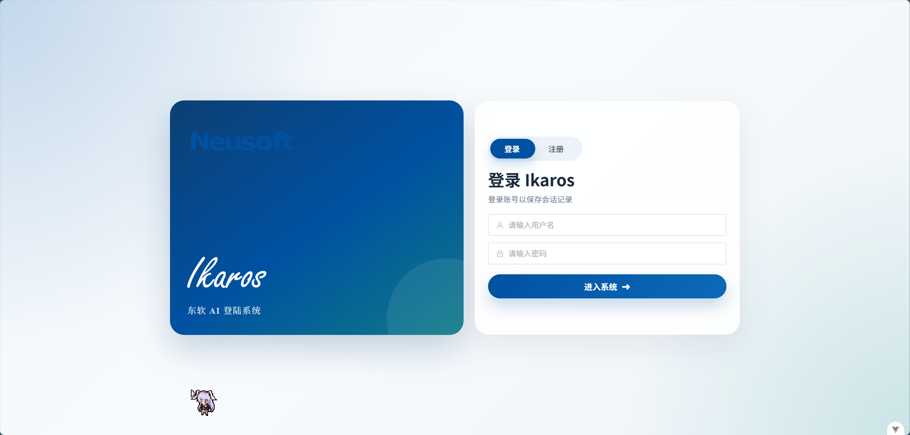
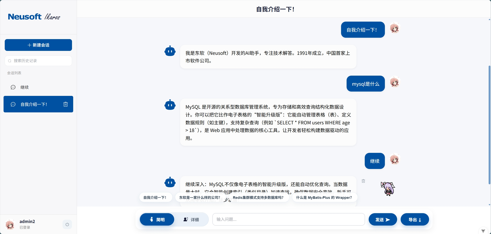

# NeusoftIkaros
> [!NOTE]
> The main repo for NeusoftIkaros.
>
> NeusoftIkaros 的主要仓库。

> [!NOTE]
> During the internship, a knowledge base system titled “Neusoft AI Assistant” was developed using a front-end and back-end separation architecture. The system is built with Spring Boot and Vue.js, and uses Element Plus as the UI framework.
>
> 在实习期间以“东软AI助手”为主题开发的知识库，采用**前后端分离架构**实现，基于 SpringBoot 与 Vue.js，采用 Element Plus 作为 UI 框架。

> [!NOTE]
> The system integrates a local large language model (qwen3:4b) through Ollama, enabling local AI-powered question answering capabilities. It supports user registration and login, session management, and adjustable LLM response tone switching.
>
> 通过 ollama 接入本地大模型 qwen3:4b，支持**登录注册、会话管理、大模型语气切换**及**文件导出**。

> [!TIP]
> This project is provided as-is and is not actively maintained
>
> Only critical bugs affecting runtime stability will be addressed
>
> Feature requests and non-critical issues are not guaranteed to be responded to
>
> 本项目仅按初始状态提供，**不保证持续维护**
>
> 仅在出现影响运行的严重问题时进行修复
>
> 功能建议与一般性问题**可能不会被处理**


 ![Qwen3](https://img.shields.io/badge/Qwen3：4B-6741D9?style=flat-square&logo=data:image/svg+xml;base64,M12.604 1.34c.393.69.784 1.382 1.174 2.075a.18.18 0 00.157.091h5.552c.174 0 .322.11.446.327l1.454 2.57c.19.337.24.478.024.837-.26.43-.513.864-.76 1.3l-.367.658c-.106.196-.223.28-.04.512l2.652 4.637c.172.301.111.494-.043.77-.437.785-.882 1.564-1.335 2.34-.159.272-.352.375-.68.37-.777-.016-1.552-.01-2.327.016a.099.099 0 00-.081.05 575.097 575.097 0 01-2.705 4.74c-.169.293-.38.363-.725.364-.997.003-2.002.004-3.017.002a.537.537 0 01-.465-.271l-1.335-2.323a.09.09 0 00-.083-.049H4.982c-.285.03-.553-.001-.805-.092l-1.603-2.77a.543.543 0 01-.002-.54l1.207-2.12a.198.198 0 000-.197 550.951 550.951 0 01-1.875-3.272l-.79-1.395c-.16-.31-.173-.496.095-.965.465-.813.927-1.625 1.387-2.436.132-.234.304-.334.584-.335a338.3 338.3 0 012.589-.001.124.124 0 00.107-.063l2.806-4.895a.488.488 0 01.422-.246c.524-.001 1.053 0 1.583-.006L11.704 1c.341-.003.724.032.9.34zm-3.432.403a.06.06 0 00-.052.03L6.254 6.788a.157.157 0 01-.135.078H3.253c-.056 0-.07.025-.041.074l5.81 10.156c.025.042.013.062-.034.063l-2.795.015a.218.218 0 00-.2.116l-1.32 2.31c-.044.078-.021.118.068.118l5.716.008c.046 0 .08.02.104.061l1.403 2.454c.046.081.092.082.139 0l5.006-8.76.783-1.382a.055.055 0 01.096 0l1.424 2.53a.122.122 0 00.107.062l2.763-.02a.04.04 0 00.035-.02.041.041 0 000-.04l-2.9-5.086a.108.108 0 010-.113l.293-.507 1.12-1.977c.024-.041.012-.062-.035-.062H9.2c-.059 0-.073-.026-.043-.077l1.434-2.505a.107.107 0 000-.114L9.225 1.774a.06.06 0 00-.053-.031zm6.29 8.02c.046 0 .058.02.034.06l-.832 1.465-2.613 4.585a.056.056 0 01-.05.029.058.058 0 01-.05-.029L8.498 9.841c-.02-.034-.01-.052.028-.054l.216-.012 6.722-.012z&logoColor=white) 


---

## 🖼️ 示例截图(Demo Screenshots)

<p align="center">
  
  <br/>
  登录页
</p>
<br/>
<p align="center">
  
  <br/>
  聊天页
</p>

---

## 🔗 相关仓库(Related Repositories)
[](https://github.com/NeusoftIkaros/ikaros-vue)
[](https://github.com/NeusoftIkaros/ikaros-vue/releases)
[](https://github.com/NeusoftIkaros/ikaros-springboot)
[](https://github.com/NeusoftIkaros/ikaros-springboot/releases)
[](https://github.com/NeusoftIkaros/ikaros-modelfile)

## 🚀 快速开始(Quick Start)
**0. 在开始之前，可以新建一个文件夹**

```bash
mkdir NeusoftIkaros
cd NeusoftIkaros
```
**1. 下载对应 Releases( [前端](https://github.com/NeusoftIkaros/ikaros-vue/releases) | [后端](https://github.com/NeusoftIkaros/ikaros-springboot/releases) )并解压**

**2. 导入 SQL**

```bash
curl -L -o neusoft_ikaros.sql https://raw.githubusercontent.com/NeusoftIkaros/NeusoftIkaros/main/neusoft_ikaros.sql
mysql -u root -p < neusoft_ikaros.sql
```
**3. 安装 ollama 并运行虚拟服务器**

```bash
curl -fsSL https://ollama.com/install.sh | sh
curl -L -o Modelfile https://raw.githubusercontent.com/NeusoftIkaros/ikaros-modelfile/main/Modelfile
ollama pull qwen3:4b
ollama create neusoft-ikaros -f Modelfile
ollama serve
```
**4. 启动后端**

```bash
curl -L -o application.properties.example https://raw.githubusercontent.com/NeusoftIkaros/ikaros-springboot/main/application.properties.example
```
>[!WARNING]
> 根据本地的实际环境修改配置，重命名文件为 `application.properties`
>
> 并确保**该文件与** `.jar` **文件处于同一目录**后再继续运行
```bash
java -jar ikaros-springboot-0.0.1-SNAPSHOT.jar --spring.config.location=application.properties
```
**5. 启动前端**

在解压后的根目录处
```bash
npm install -g serve
serve dist
```
**6. 访问项目**

打开浏览器，访问 `http://localhost:3000`

## ⚙️ 部署指南(Deployment Guide)

### 推荐环境要求
- MySQL 8.x
- JDK 17
- Node.js 20+
- npm 10+
- Maven 3.9+
- ollama 0.21.0+

> [!TIP]
> 如果你使用 GitHub Release 中已经打包好的后端 `.jar`，通常不需要再单独下载 Maven 依赖
> 
> **只有在你从源码启动或自行重新打包时，才需要下载对应依赖**

### 创建数据库
本项目已提供 [SQL
脚本](https://github.com/NeusoftIkaros/NeusoftIkaros/blob/main/neusoft_ikaros.sql)，下载后运行
```bash
mysql -u root -p < [sql文件路径]
```

### 约束及运行LLM
通过ollama下载 `qwen3:4b` 模型

```bash
ollama pull qwen3:4b
```

下载 [Modelfile](https://github.com/NeusoftIkaros/ikaros-modelfile/blob/main/Modelfile) 后使用以下命令约束模型

```bash
ollama create neusoft-ikaros -f [Modelfile文件路径]
```

然后运行 ollama 虚拟服务

```bash
ollama serve
```


### 修改后端配置文件
下载 [application.properties.example](https://github.com/NeusoftIkaros/ikaros-springboot/blob/main/application.properties.example) 并按本地的实际环境修改以下配置:

```properties
spring.datasource.url=jdbc:mysql://localhost:3306/neusoft_ikaros?useUnicode=true&characterEncoding=utf8&serverTimezone=Asia/Shanghai
spring.datasource.username=root
spring.datasource.password=123456
server.port=8080
```

然后改名为 `application.properties`

### 运行后端
- 如果你使用 [.jar](https://github.com/NeusoftIkaros/ikaros-springboot/releases) 文件，直接在**文件存放处**执行以下命令

```bash
java -jar ikaros-springboot-0.0.1-SNAPSHOT.jar --spring.config.location=[application.properties文件路径]
```
- 如果你使用 [源码](https://github.com/NeusoftIkaros/ikaros-springboot/releases)，执行以下操作:

将文件复制到 `ikaros-springboot\src\main\resources\` 覆盖原本存在的 `application.properties` 文件,然后在**项目根目录处**执行以下命令

```bash
mvn spring-boot:run
```

> [!IMPORTANT]
> 依照开发者使用环境，`.jar` 中封装的数据库端口号为 `3307`，所以**请务必使用** `application.properties` **文件重新配置数据库端口号**
> 
> 默认的 `application.properties` 中数据库用户为 `admin`，密码为 `123456`

### 运行前端
- 如果你使用 [dist](https://github.com/NeusoftIkaros/ikaros-vue/releases/tag/v1.x) 包，直接在**解压后的根目录处**执行以下命令

```bash
npm install -g serve
serve dist
```

- 如果你使用 [源码](https://github.com/NeusoftIkaros/ikaros-vue)，直接在**项目根目录处**执行以下命令

```bash
npm run dev
```

### 使用项目
- 如果你通过 `serve` 来使用 dist 包，那么打开浏览器，访问 `http://localhost:3000`
- 如果你通过 `npm run dev` 命令来直接运行源码，那么打开浏览器，访问 `http://localhost:5173`

## 🔌 接口规范(API Specification)
*参见本 repo 下的 [API_REFERENCE.md](https://github.com/NeusoftIkaros/NeusoftIkaros/blob/main/API_REFERENCE.md)*

## ⚠️ 免责声明

> [!CAUTION]
> **本项目为独立的学习与个人开发项目。**
>
> **本项目中所提到的东软（或Neusoft）与现实中的东软集团股份有限公司（官方英文注册名：Neusoft Corporation）及其任何子公司、关联公司、海外分支机构、研究机构、教育机构或其他相关组织均无关，该项目与上述所列机构无任何隶属、授权或官方关联关系。**

